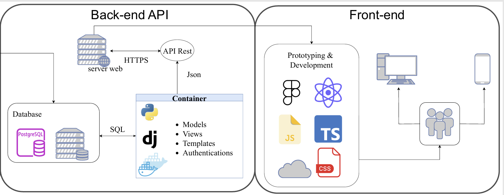

# PV Simulation Platform – Dissertation Project (FEEC/UNICAMP)

This repository contains the source code developed for the Master's dissertation titled  
**"Development of a Software Platform for Research and Advanced Simulations in Photovoltaic Systems"**,  
presented at the School of Electrical and Computer Engineering (FEEC), UNICAMP.



[More information in the Article](https://doi.org/10.5753/erigo.2024.4791.)

## 📦 Repository Structure
```
├── backend_py/         # Python backend for data processing and API services
├── frontend-ts/        # Frontend built with TypeScript (SPA interface)
├── nginx              # Reverse proxy configuration for deployment
├── .env                # Environment variables (example file)
├── docker-compose.yml  # Container orchestration for local deployment
├── LICENSE             # MIT License
└── README.md           # Project documentation
```

## 🚀 Features

- Interactive map for selecting geographic coordinates
- Irradiance analysis using models such as Ineichen Clear Sky
- Integration with Brazilian solarimetric databases
- Custom report generation based on user input
- Modular architecture using microservices
- Dockerized deployment with NGINX reverse proxy

## 🛠️ Technologies Used

- **Backend**: Python, Django
- **Frontend**: TypeScript, React
- **Deployment**: Docker, NGINX
- **Data Sources**: Brazilian PV databases, custom irradiance models

## 📊 Use Case

This platform enables researchers and professionals to simulate photovoltaic performance based on location-specific irradiance data. It supports comparative analysis between datasets and is designed to be scalable and extensible for future research needs.

## 🧪 How to Run Locally

1. Clone the repository:
   ```bash
   git clone https://github.com/IsabelleFSNunes/CodesProjectDissertationFEEC.git
   cd CodesProjectDissertationFEEC
   ```

2. Create a `.env` file based on the provided template.

3. Run the application using Docker:
   ```bash
   docker-compose up --build
   ```

4. Access the platform at `http://localhost` in your browser.

## 📚 Academic Context

This project was developed as part of a Master's research at UNICAMP, aiming to address limitations in existing PV simulation tools by offering a flexible, locally adapted, and research-oriented platform.

## 📈 Preliminary Results

Simulations conducted using data from PV plants in complex terrain regions demonstrated the platform's ability to generate reliable irradiance analyses. The modular design also allows for future integration of downscaling techniques and additional irradiance models.

## 📄 License

This project is licensed under the [MIT License](LICENSE).

---